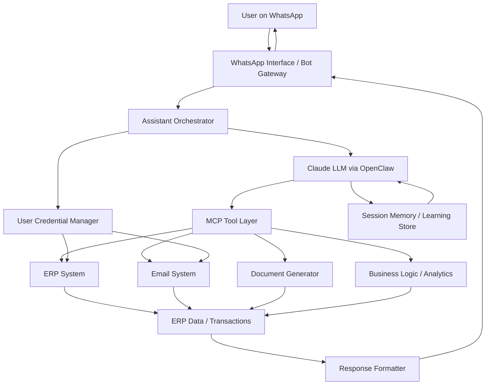

# ERPNext MCP Integration with Claude Desktop

Connect ERPNext to Claude Desktop using an MCP (Model Context Protocol) server.

This setup allows Claude to securely interact with your ERPNext instance via API — fetching data, listing DocTypes, retrieving customers, and more.

---

##  Architecture Overview

```
Claude Desktop
      ↓
MCP Server (Node.js)
      ↓
ERPNext REST API
      ↓
ERPNext Database
```

---

#  Requirements

- Node.js (v18+ recommended)
- Git
- Claude Desktop
- ERPNext instance with API access enabled

---

#  Step 1 — Configure ERPNext API

1. Login to ERPNext.
2. Go to **User List**.
3. Click on you username.
4. Go to Settings and Look for **API Access** section.
5. Click **Generate API Key & Secret**.
6. Copy:
   - API Key
   - API Secret

### Test API Connectivity

Open in browser:

```
https://yourerp.com/api/method/ping
```

Expected response:

```json
{"message":"pong"}
```

---

#  macOS Installation

## 1. Clone MCP Server

```bash
mkdir MCP_Servers
cd ~/MCP_Servers
mkdir Frappe_MCP
cd Frappe_MCP
git clone https://github.com/rakeshgangwar/erpnext-mcp-server.git
cd erpnext-mcp-server
npm install
npm run build
```

Confirm build output:

```bash
ls build
```

---

## 2. Configure Claude Desktop (macOS)

Open:

```
~/Library/Application Support/Claude/claude_desktop_config.json
```

Add:

```json
{
  "mcpServers": {
    "erpnext": {
      "command": "node",
      "args": [
        "/Users/YOUR_USERNAME/Projects/Frappe_MCP/erpnext-mcp-server/build/index.js"
      ],
      "env": {
        "ERPNEXT_URL": "https://yourerp.com",
        "ERPNEXT_API_KEY": "your_api_key",
        "ERPNEXT_API_SECRET": "your_api_secret"
      }
    }
  }
}
```

Save and fully restart Claude.

---

# Windows Installation

## 1. Clone MCP Server

```powershell
cd C:\Users\YourName\Documents
mkdir Frappe_MCP
cd Frappe_MCP
git clone https://github.com/rakeshgangwar/erpnext-mcp-server.git
cd erpnext-mcp-server
npm install
npm run build
```

Confirm:

```powershell
dir build
```

---

## 2. Configure Claude Desktop (Windows)

Open:

```
C:\Users\YourName\AppData\Roaming\Claude\claude_desktop_config.json
```

Add:

```json
{
  "mcpServers": {
    "erpnext": {
      "command": "node",
      "args": [
        "C:\\Users\\YourName\\Documents\\Frappe_MCP\\erpnext-mcp-server\\build\\index.js"
      ],
      "env": {
        "ERPNEXT_URL": "https://yourerp.com",
        "ERPNEXT_API_KEY": "your_api_key",
        "ERPNEXT_API_SECRET": "your_api_secret"
      }
    }
  }
}
```

⚠ Windows requires double backslashes (`\\`).

Restart Claude completely.

---

# Testing the Integration

After restarting Claude Desktop, test with:

```
List available ERPNext tools.
```

Then try:

```
Get 5 customers.
```

If working correctly:
- Claude will show a tool call
- Data will be returned from ERPNext

---

#  Manual Debugging

## Validate JSON Config

```bash
cat claude_desktop_config.json | python -m json.tool
```

## Test MCP Server Directly

```bash
node build/index.js
```

## Test ERPNext API

```bash
curl https://yourerp.com/api/method/ping
```

---

#  Security Best Practices

- Do NOT use Administrator API keys
- Regenerate keys if exposed
- Use HTTPS only
- Create a dedicated “AI User”
- Assign minimum required roles

---

#  Project Structure

```
MCP_Server/
 └── erpnext-mcp-server/
     ├── build/
     │   └── index.js
     ├── package.json
     └── README.md
```

---

#  Final Checklist

- [ ] ERPNext API reachable
- [ ] Node installed
- [ ] MCP server built
- [ ] JSON config valid
- [ ] Claude restarted
- [ ] Tool calls visible

---


## Data Flow Diagram



## Flow Explanation

1. **User Interaction**
   - User sends a request through **WhatsApp**.

2. **Interface Layer**
   - WhatsApp bot receives the message and forwards it to the **Assistant Orchestrator**.

3. **Reasoning Layer**
   - The request is processed by **Claude via OpenClaw**, which determines intent and required actions.

4. **Tool Execution via MCP**
   - MCP connects the LLM to available tools:
     - ERP queries
     - Email retrieval
     - Document generation
     - Business analytics

5. **Credential Control**
   - Each session runs with **user-specific ERP credentials**, ensuring role-based access.

6. **Execution**
   - The system can:
     - Query ERP
     - Create sales orders / quotations
     - Identify leads or opportunities
     - Generate documents

7. **Learning Layer**
   - Insights and execution learnings are stored in **session memory**, allowing the assistant to improve future responses.

8. **Response Delivery**
   - Results are formatted and returned to the **user on WhatsApp**.
